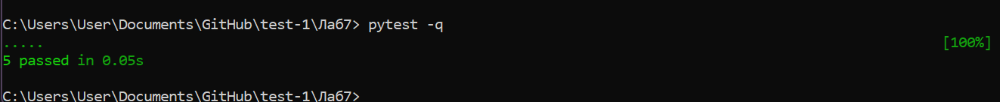

# Lab 7 — Layered Architecture + DI + DDD-lite

Небольшой учебный проект: система оплаты заказа с разделением на слои и упрощённой доменной моделью (DDD-lite).
Логика оплаты оформлена как use-case, зависимости прокидываются через интерфейсы (DI), инфраструктура — in-memory и fake.

## Layers

### Domain
- `Order` — сущность/aggregate root
- `OrderLine` — часть агрегата
- `Money` — value object (целые “копейки/центы”, без float)
- `OrderStatus` — статус заказа

**Инварианты:**
- нельзя оплатить пустой заказ
- нельзя оплатить заказ повторно
- после оплаты нельзя менять строки заказа
- итоговая сумма равна сумме строк

### Application
- `PayOrderUseCase`: загружает заказ из репозитория, вызывает доменную операцию `pay()`,
  списывает деньги через `PaymentGateway`, сохраняет заказ и возвращает результат оплаты.

### Interfaces (Ports)
- `OrderRepository`: `get_by_id(order_id)`, `save(order)`
- `PaymentGateway`: `charge(order_id, money)`

### Infrastructure
- `InMemoryOrderRepository` — хранит заказы в памяти
- `FakePaymentGateway` — имитирует успешный/неуспешный платёж

### Tests
Тесты проверяют use-case и доменные инварианты без реальной БД.

